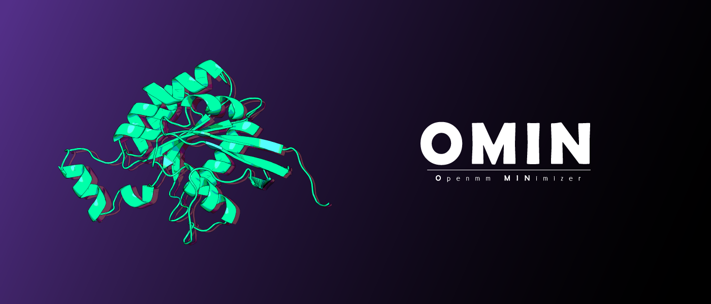
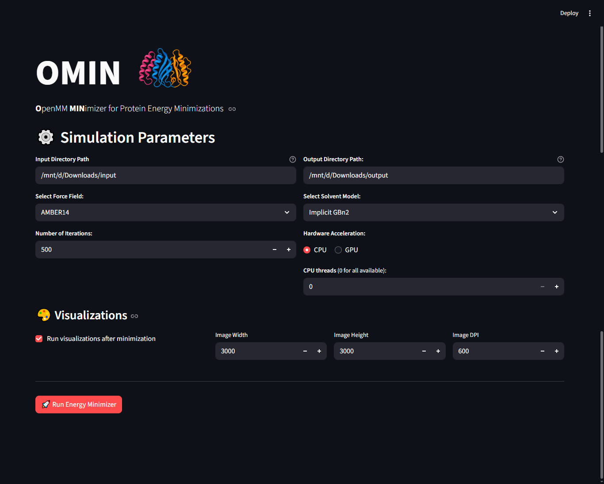
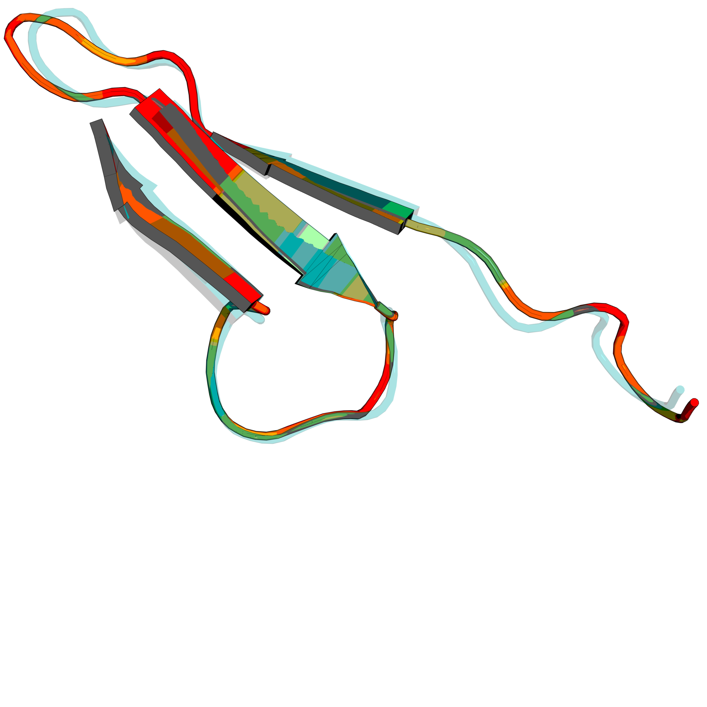
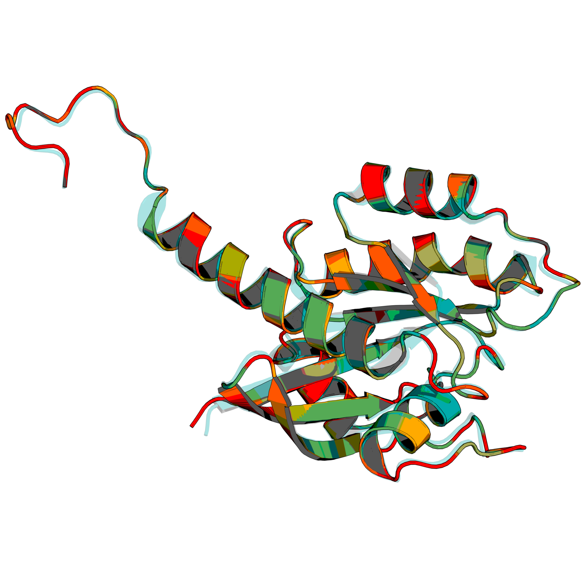

## 📑 Table of contents

1. [📋 Overview](#-overview)
2. [📦 Installation](#-installation)
3. [🏃 How to run](#-how-to-run)
4. [📂 Input file formats & expected structure](#-input-file-formats--expected-structure)
5. [🔄 App workflow](#-app-workflow)
6. [⚛️ Supported force fields and solvent models](#-supported-force-fields-and-solvent-models)
7. [🎨 Visualization features](#-visualization-features)
8. [⚠️ Limitations and considerations](#-limitations-and-considerations)
9. [📚 Citation](#-citation)
10. [🤝 Acknowledgements](#-acknowledgements)


## 📋 Overview

<p align="justify"> <b>OMIN</b> (OpenMM MINimizer) is a comprehensive web application built with Streamlit that performs protein energy minimization using OpenMM force fields and generates structural visualizations with RMSD analysis. It provides an intuitive interface for biochemists and structural biologists to process multiple PDB files simultaneously. </p>



**OMIN** integrates several powerful computational tools into a single streamlined workflow:
- **PDB Fixing:** Automatically repairs common issues in PDB files using [PDBFixer](https://github.com/openmm/pdbfixer)
- **Energy Minimization:** Performs molecular mechanics minimization using [OpenMM](https://github.com/openmm/openmm)
- **Structural Comparison:** Computes global and per-residue RMSD between raw and minimized structures
- **Visualization:** Generates publication-quality structural images colored by RMSD values
- **Batch Processing:** Handles multiple PDB files in a single run
- **Supports:** The application supports both explicit and implicit solvent models, CPU/GPU acceleration, and produces comprehensive output files for further analysis.

## 📦 Installation

### Prerequisites

- Python 3.10 or higher
- Conda package manager (recommended for `OpenMM` installation)

### Step-by-Step Installation

1. Clone the repository:

```bash
git clone https://github.com/yourusername/omin.git
cd omin
```

2. Create and activate a Conda environment:

```bash
conda create -n omin python=3.10 -y
conda activate omin
```

3. Install OpenMM:

```bash
conda install -c conda-forge openmm -y
```

4. Install PyMOL:

```bash
conda install -c conda-forge pymol-open-source -y 
```

5. Install remaining dependencies:

```bash
pip install -r requirements.txt
```

## 🏃 How to Run

- Activate the environment:

```bash
conda activate omin
```

- Run the Streamlit app:

```bash
streamlit run app.py
```

- Configure parameters in the web interface and run the analysis.

## 📂 Input File Formats & Expected Structure

**Input Requirements:**

- File Format: Standard PDB files (.pdb extension)
- Directory Structure: All PDB files should be placed in a single input directory
- File Contents: Should contain standard protein structures with proper atom naming
- Multiple Chains: Supported, but chains must be consistently labeled
- Ligands/Non-standard Residues: May require manual preparation, as PDBFixer handles standard residues best

**Directory Structure and Output Files:**

- OMIN generates organized output in the specified directory:

```r
output_directory/
├── minimized-clean/          # Minimized structures without solvent
├── minimized-solvent/        # Minimized structures with explicit solvent (if used)
├── minimized-implicit/       # Minimized structures with implicit solvent (if used)
├── visualizations/           # Generated images and PyMOL sessions
│   ├── protein1.png
│   ├── protein1.pse
│   └── ...
├── energies.csv              # Energy minimization results
├── per_residue_rmsd_combined.csv  # Detailed per-residue RMSD data
├── global_rmsd_summary.csv   # Summary of global RMSD values
└── simulation_parameters.txt # Metadata about the run
```

##### File descriptions:

**Data files:**
- `energies.csv` Initial and minimized energies for each protein
- `per_residue_rmsd_combined.csv` RMSD values for each residue across all proteins
- `global_rmsd_summary.csv` Global RMSD values for quick comparison

**Metadata:**
- `simulation_parameters.txt` Complete record of simulation settings

## 🔄 App workflow

#### Phase 1: PDB preparation
- Load PDB files from the input directory
- Fix common issues (missing atoms, residues, hydrogens) using `PDBFixer`
- Add missing hydrogens at pH 7.4

#### Phase 2: System setup
- Select force field (CHARMM36 or AMBER variants)
- Choose solvent model (explicit: TIP3P/SPC/E, implicit: GBn2/OBC2)
- Configure hardware acceleration (CPU/GPU)

#### Phase 3: Energy minimization
- Create a molecular mechanics system
- Perform energy minimization (500 iterations by default)
- Calculate energy differences
- Save minimized structures

#### Phase 4: Visualization/RMSD analysis (Optional)
- Align minimized structures to the original
- Compute global RMSD
- Calculate per-residue RMSD
- Generate color-coded visualizations

#### Phase 5: Output generation
- Save all processed files
- Generate comprehensive CSV reports
- Create visualization images and sessions
- Save metadata for reproducibility

## ⚛️ Supported force fields and solvent models

**Force fields:**
- CHARMM36 (recommended for membrane proteins)
- AMBER14 (general purpose, supports implicit solvent)
- AMBER99SB (older but well-tested)
- AMBER03/AMBER10 (legacy versions)

**Solvent models:**
- Explicit: TIP3P, SPC/E water models
- Implicit: GBn2, OBC2 generalized Born models

## 🎨 Visualization features

- **Custom color gradient:** Greencyan (low RMSD) → Orange → Red (high RMSD)
- **Transparency overlay:** Semi-transparent raw structure overlay
- **High-resolution output:** Configurable image dimensions and DPI
- **Interactive sessions:** PyMOL session files for detailed exploration
- **Publication-ready:** Professional rendering with lighting and shadows





## ⚠️ Limitations and considerations

- Large systems: Very large proteins (>1000 residues) may require significant computational resources
- GPU memory: GPU acceleration requires sufficient VRAM for explicit solvent simulations
- Non-standard residues: Ligands and unusual residues may not be parameterized correctly
- Missing electron density: PDBFixer can add missing atoms but cannot correct conformational errors
- PyMOL dependency: Visualization requires PyMOL installation

## 📚 Citation
- If you use `OMIN` in your research, please cite:

```
OMIN. GitHub: https://github.com/usman4373/OMIN
```

## 🤝 Acknowledgements

**Please also cite:**
- `OpenMM` Team for the powerful molecular dynamics framework
- `PyMOL` Developers for the visualization software
- `Streamlit` Team for the web application framework
- `PDBFixer` Developers for the PDB repair tools
- All force field developers (CHARMM, AMBER teams)
- Other open-source tools and libraries used in the pipeline

---
